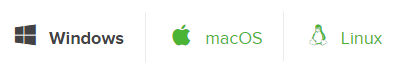
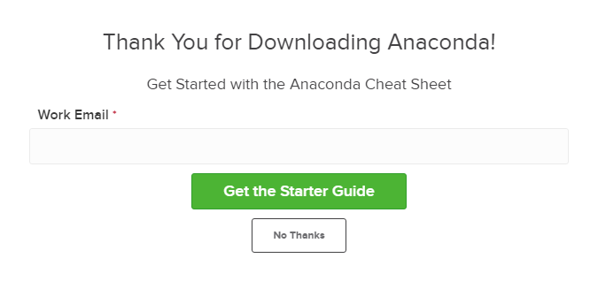
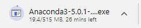
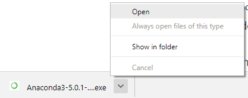
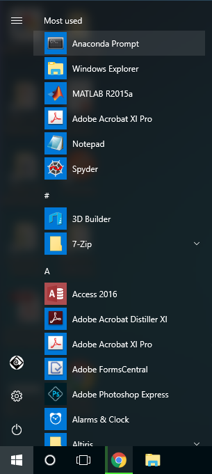
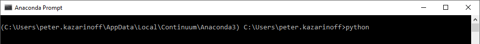
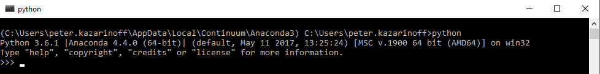
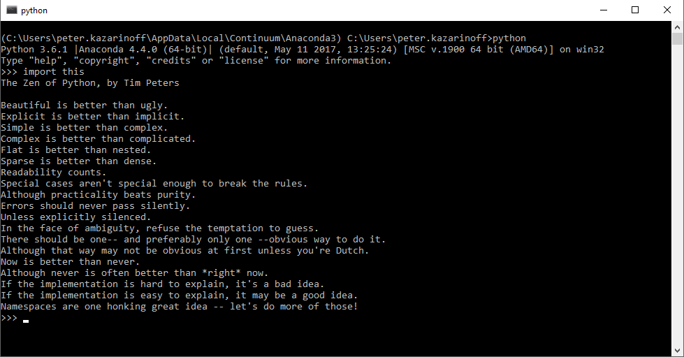

## Installing Anaconda on Windows
For problem solvers, I recommend installing and using the Anaconda distribution of Python.
This section details the installation of the Anaconda distribution of Python on Windows 10. I think the Anaconda distribution of Python is the best option for problem solvers who want to use Python. Anaconda is free (although the download is large which can take time) and can be installed on school or work computers where you don't have administrator access or the ability to install new programs. Anaconda comes bundled with about 600 packages pre-installed including **NumPy**, **Matplotlib** and **SymPy**. These three packages are very useful for problem solvers and will be discussed in subsequent chapters.

Follow the steps below to install the Anaconda distribution of Python on Windows.

#### Steps:

1. Visit [Anaconda.com/downloads](https://www.anaconda.com/download/)

2. Select Windows

3. Download the **_.exe_** installer

4. Open and run the **_.exe_** installer

5. Open the **Anaconda Prompt** and run some Python code
#### 1. Visit the Anaconda downloads page

Go to the following link: [Anaconda.com/downloads](https://www.anaconda.com/download/)

The Anaconda Downloads Page will look something like this:


#### 2. Select Windows

Select Windows where the three operating systems are listed.


#### 3. Download

Download the most recent Python 3 release. At the time of writing, the most recent release was the Python 3.6 Version. Python 2.7 is legacy Python. For problem solvers, select the Python 3.6 version. If you are unsure if your computer is running a 64-bit or 32-bit version of Windows, select 64-bit as 64-bit Windows is most common.


You may be prompted to enter your email. You can still download Anaconda if you click ```[No Thanks]``` and don't enter your Work Email address.



The download is quite large (over 500 MB) so it may take a while to for Anaconda to download.


#### 4. Open and run the installer

Once the download completes, open and run the **_.exe_** installer



At the beginning of the install, you need to click **Next** to confirm the installation.


Then agree to the license.


At the Advanced Installation Options screen, I recommend that you **do not check** "Add Anaconda to my PATH environment variable"


#### 5. Open the Anaconda Prompt from the Windows start menu

After the installation of Anaconda is complete, you can go to the Windows start menu and select the Anaconda Prompt.



This opens the **Anaconda Prompt**. **Anaconda** is the Python distribution and the **Anaconda Prompt** is a command line shell (a program where you type in commands instead of using a mouse). The black screen and text that makes up the **Anaconda Prompt** doesn't look like much, but it is really helpful for problem solvers using Python.

At the Anaconda prompt, type ```python``` and hit ```[Enter]```. The ```python``` command starts the Python interpreter, also called the Python REPL (for Read Evaluate Print Loop).

```text
> python
```



Note the Python version. You should see something like ```Python 3.6.1```.  With the interpreter running, you will see a set of greater-than symbols ```>>>``` before the cursor. 



Now you can type Python commands. Try typing ```import this```. You should see the **_Zen of Python_** by Tim Peters



To close the Python interpreter, type ```exit()``` at the prompt ```>>>```.  Note the double parenthesis at the end of the ```exit()``` command. The ```()``` is needed to stop the Python interpreter and get back out to the **Anaconda Prompt**.

To close the **Anaconda Prompt**, you can either close the window with the mouse, or type ```exit```, no parenthesis necessary.

When you want to use the Python interpreter again, just click the Windows Start button and select the **Anaconda Prompt** and type ```python```.
 

