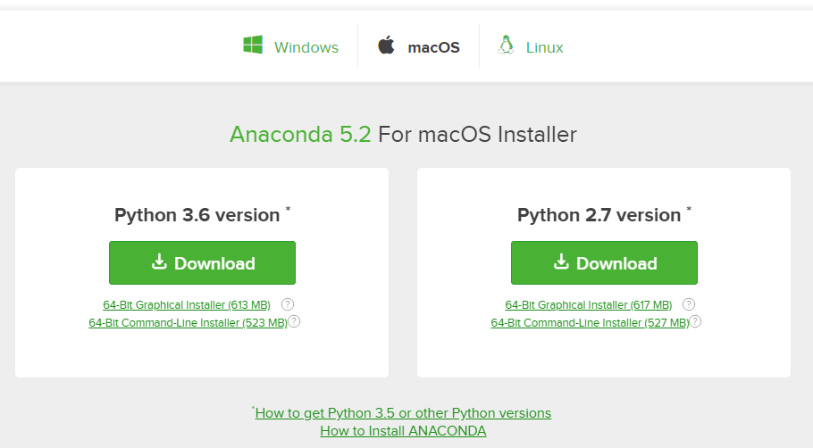

## Installing Anaconda on MacOS
This section details the installation of the Anaconda Distribution of Python on MacOS. Most versions of MacOS come pre-installed with legacy Python (Version 2.7). You can confirm the legacy version of Python is installed on MacOS by opening and running a command at the MacOS **terminal**. To open the MacOS terminal use ```[command]+[Space Bar]``` and type ```terminal``` in the Spotlight Search bar.

In the MacOS Terminal type (note: the dollar sign ```$``` is used to indicate the terminal prompt. The dollar sign ```$``` does not need to be typed):

```
$ python
```

You will most likely see Python version 2.7 is installed. An issue for MacOS users is that the installed system version of Python has a set of permissions that may always allow Python to run and may not allow users to install external packages.  Therefore, I recommend the Anaconda distribution of Python is installed alongside the system version of Python that comes pre-installed with MacOS. You will be able to run Python code using the Anaconda distribution of Python, and you will be able to install external packages using the Anaconda distribution of Python.

Follow the steps below to install the Anaconda distribution of Python on MacOS.

#### Steps:

1. Visit [Anaconda.com/downloads](https://www.anaconda.com/download/)

2. Select MacOS and Download the **_.pkg_** installer

3. Open the **_.pkg_** installer

4. Follow the installation instructions

5. Source your **_.bash-rc_** file

6. Open a terminal and type ```python``` and run some code.
#### 1. Visit the Anaconda downloads page

Go to the following link: [Anaconda.com/downloads](https://www.anaconda.com/download/)

#### 2. Select MacOS and download the .pkg installer

In the operating systems box, select ```[MacOS]```. Then download the most recent Python 3 distribution (at the time of this writing the most recent version is Python 3.6) graphical installer by clicking the Download link. Python 2.7 is legacy Python. For problem solvers, select the most recent Python 3 version.



You may be prompted to enter your email. You can still download Anaconda if you click ```[No Thanks]``` or ```[x]``` and don't enter your Work Email address.


#### 3. Open the .pkg installer

Navigate to the Downloads folder and double-click the **_.pkg_** installer file you just downloaded. It may be helpful to order the contents of the Downloads folder by date to find the **_.pkg_** file.
#### 4. Follow the installation instructions

Follow the installation instructions. It is advised that you install **Anaconda** for the current user and that **Anaconda** **is added to your PATH**.
#### 5. Source your .bash-rc file

Once Anaconda is installed, you need to load the changes to your ```PATH``` environment variable in the current terminal session.

Open the MacOS Terminal and type:
    
```text
$ cd ~
$ source .bashrc
```
#### 6. Open a terminal and type ```python``` and run some code.

Open the MacOS Terminal and type:
    
```text
$ python
```

You should see something like

```text
Python 3.6.3 | Anaconda Inc. |
```

At the Python REPL (the Python ```>>>``` prompt) try:

```text
>>> import this
```

If you see the Zen of Python, the installation was successful. Exit out of the Python REPL using the command ```exit()```. Make sure to include the double parenthesis ```()``` after the ```exit``` command.

```text
>>> exit()
```
 

