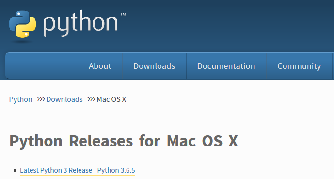

## Installing Python from Python.org
Below is the recommended way to install a new version of Python from Python.org on each of the three major operating systems: Windows, MacOS and Linux.

This book is based on Python version 3.6.  Some of the examples in the book may not work properly on legacy Python (version 2.7).  I recommend installing the Anaconda Distribution of Python on Windows and MacOSX. The installation of Anaconda on these operating systems was detailed in previous sections.
### Installing Python on Windows

Go to [https://www.python.org/downloads/](https://www.python.org/downloads/) and download the latest release. Make sure to select the box ```[add Python to my path]``` during the installation. 


### Installing Python on MacOS

Go to [https://www.python.org/downloads/mac-osx/](https://www.python.org/downloads/mac-osx/) and download the latest release. 


### Installing Python on Linux

Open a terminal and enter ```$ python``` to see if a version of Python is already installed on the system.

```text
$ python
Python 2.7.12 (default, Dec  4 2017, 14:50:18)
[GCC 5.4.0 20160609] on linux2
Type "help", "copyright", "credits" or "license" for more information.
>>> exit()
```

In the code block above, the version of Python is ```Python 2.7.12```. If the Python version is 2.7 or below, try the command ```$ python3```.

```text
$ python3
Python 3.6.7 (default, Oct 22 2018, 11:32:17) 
[GCC 8.2.0] on linux
Type "help", "copyright", "credits" or "license" for more information.
>>> exit()
```

If no version of Python is shown, you can download a release of Python 3.6 from the deadsnakes package repository.

```text
$ sudo add-apt-repository ppa:deadsnakes/ppa
[Enter]
$ sudo apt-get update
$ sudo apt-get install python3.6
```

After installation, you may need to append your PATH environment variable to ensure the newly installed Python 3.6 version is the version of Python called when using the terminal. The commands below will add ```/usr/bin``` to your ```PATH```, and add an alias in **_.bashrc_** so that the command ```$ python3.6``` produces the Python 3.6 REPL. Take care to ensure the double chevron ```>>``` is used, as a single chevron ```>``` will overwrite the **_.bashrc_** file.

```text
$ cd ~
$ echo  "PATH=/usr/bin:$PATH" >> ~/.bashrc 
$ echo "alias python3.6='/usr/bin/python3.6'" >> ~/.bashrc
$ source .bashrc
$ python3.6
Python 3.6.6 (default, Jun 28 2018, 04:42:43)
[GCC 5.4.0 20160609] on linux
Type "help", "copyright", "credits" or "license" for more information.
>>> exit()
```
 

