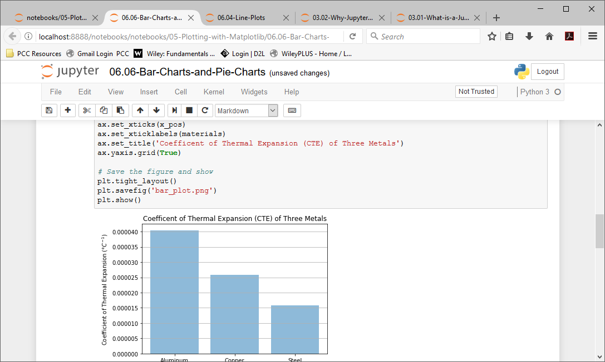

## Why Jupyter Notebooks?
There is a vast array of editors and IDE's (Integrated Development Environments) which can be used to edit and run Python code. Why should problem solvers learn to use Jupyter Notebooks? 
 
Below is a table of simple text editors and IDE's which can be used to edit and run Python code:

 | Python Text Editors and IDE's| |
 | --- | --- |
 | Notepad | simple text editor - included with Windows |
 | Idle | included with Python from Python.org |
 | Sublime Text | full-featured editor with long-time no-cost license |
 | Spyder | IDE included with the Anaconda Distribution of Python 
 | Visual Studio Code | An multi-language open source IDE |
 | PyCharm | Professional Developer-friendly Python IDE |

 
A Jupyter notebook is neither a simple text editor nor a full-featured IDE. Jupyter notebooks provide a quick and streamlined way for problem-solvers to prototype code and quickly share code.  Jupyter notebooks also provide a way for problem-solvers to share programming solutions with team members, supervisors, and customers.

In a way, Jupyter notebooks strike a balance between simple text editors, which are fast to start and simple and easy to manipulate, and IDE's which tend to start slower and be feature-rich and complex. Simple text editors typically can only edit code, and cannot run the code. A full IDE can edit code, run the code, debug code, provide syntax highlighting and context help.
In the context of problem-solving, Jupyter notebooks can be quite handy. Jupyter notebooks are quick to open and quick to produce output. Data exploration, data cleaning, and plot building are accomplished in Jupyter notebooks easier and quicker than in a text editor or an IDE. 

In the context of sharing solutions to problems, Jupyter notebooks are also useful. Markdown cells render text in different sizes, bold and italic. Tables and images, plots and code can all be shown together in the same Jupyter notebook. Notebooks can be exported to a variety of formats including **_.html_** and **_.pdf_**.
 

