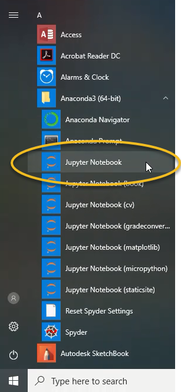
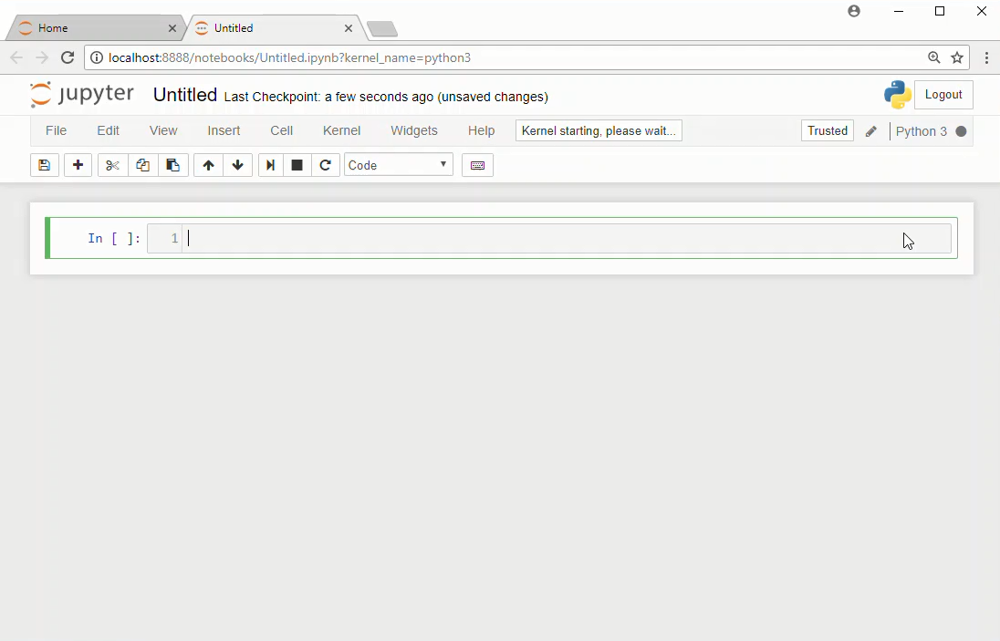
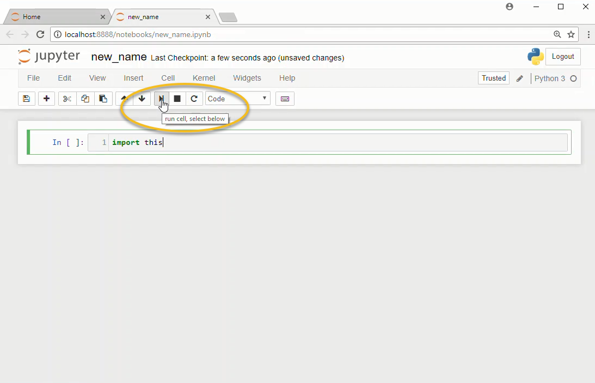
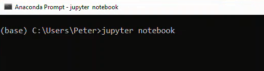
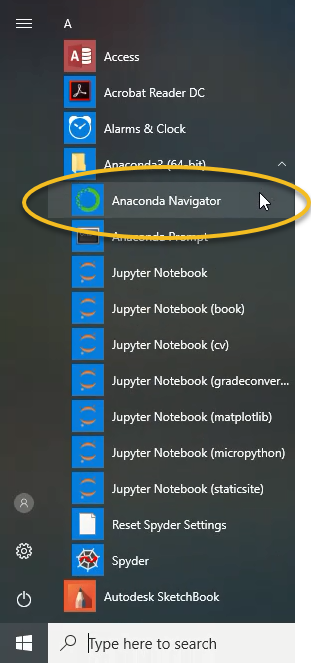

## Opening a Jupyter Notebook
In this section, you will learn how to open a Jupyter notebook on Windows and MacOS.

One way problem solvers can write and execute Python code is in a Jupyter notebook. Jupyter notebooks contain Python code, the output that code produces and markdown cells usually used to explain what the code means.

On Windows, a Jupyter notebook can be started from the **Anaconda Prompt**, the Windows start menu and **Anaconda Navigator**.

#### 3 ways to open a **Jupyter notebook**:

 * Windows Start Menu

 * **Anaconda Prompt**

 * Anaconda Navigator
### Open a Jupyter notebook with the Windows Start Menu
One simple way to open a Jupyter notebook is to use the Windows Start Menu. Note that the Anaconda distribution of Python must be installed to use the Windows Start Menu to open a Jupyter notebook. Download **Anaconda** at the following link: [Anaconda.com/downloads](https://www.anaconda.com/download/)

Open the Windows start menu and select **[Anaconda3(64 bit)]** --> **[Jupyter Notebook]**



This action opens the **Jupyter file browser** in a web browser tab. 

In the upper right select **[New]** --> **[Python 3]**


A new **notebook** will open as a new tab in your web browser.



Try typing this in the first cell in the notebook to the right of the ```In [ ]:``` prompt:

```python
import this
```

Then click the run button in the middle of the menu at the top of the notebook.


### Open a Jupyter Notebook with the Anaconda Prompt
Another method to open a Jupyter notebook is to use the **Anaconda Prompt**.

Go to the Windows start menu and select **[Anaconda Prompt]** under **[Anaconda3]**.


If you don't see the **Anaconda Prompt** in the Windows Start Menu, then you need to install the Anaconda distribution of Python. Download **Anaconda** at the following link: [Anaconda.com/downloads](https://www.anaconda.com/download/)

The **Anaconda Prompt** window should look something like the image below.



At the **Anaconda Prompt** type:

```text
> jupyter notebook
```

This command starts the **Jupyter notebook** server. The output in the **Anaconda Prompt** will look something like the output shown below:


```text

Copy/paste this URL into your browser when you connect ...

    to login with a token:

        http://localhost:8888/?token=6bdef677d3503fbb2 ...

[I 16:14:12.661 NotebookApp] Accepting one-time-token ...

```


A web browser should open, and you should be able to see the **Jupyter file browser**. If a web browser doesn't open automatically, you can copy the web address from the **Anaconda Prompt** and paste it into a web browser's address bar.


In the upper right select **[New]** --> **[Python 3]**


You will see a new tab open in your web browser. This web browser page is a **Jupyter notebook**.


### Open a Jupyter Notebook with Anaconda Navigator
One additional way to open a Jupyter notebook is to use **Anaconda Navigator**. Anaconda Navigator comes with the Anaconda distribution of Python. Open **Anaconda Navigator** using the Windows start menu and select **[Anaconda3(64-bit)]** --> **[Anaconda Navigator]**.



An **Anaconda Navigator** window will open. In the middle of the page, in the **Jupyter notebook** tile, click **[Launch]**


A **Jupyter file browser** will open in a web browser tab. 

In the upper right select **[New]** --> **[Python 3]**


A new **notebook** will open as a new tab in your web browser.


 

