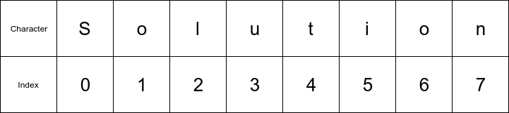
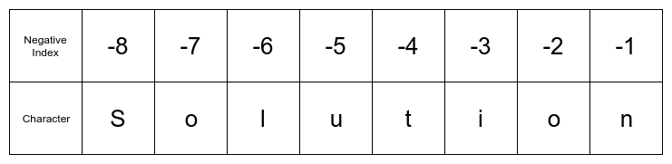

## Strings
Another built-in Python data type is _strings_. Strings are sequences of letters, numbers, symbols, and spaces. In Python, strings can be almost any length and can contain spaces. String variables are assigned in Python using quotation marks ```'   '``` or ```" "```. In Python, strings can be defined by single quotation marks ```' '``` or double quotation marks ```" "```. 

Python strings can contain blank spaces. A blank space is a valid character in Python string.

```python
>>> string = 'z'
>>>> type(string)
<class 'str'>

>>> string = 'Engineers'
>>> type(string)
<class 'str'>
```

The output ```<class 'str'>``` indicates the variable is a string.
### Numbers as Strings

Numbers and decimals can be defined as strings too. If a decimal number is defined using quotes ```'   '```, the number is saved as a string rather than as a float. Integers defined using quotes will become strings as well if surrounded by quotes.

```python
>>> num = '5.2'
>>> type(num)
<class 'str'>

>>> num = '2'
>>> type(num)
<class 'str'>
```
### Strings as Boolean Values

Strings can be converted to boolean values (converted to True or False). The empty string ```""``` returns as ```False```. All other strings convert to ```True```. 

```python
>>> name = "Gabby"
>>> bool(name)
True
```

```python
>>> empty = ""
>>> bool(empty)
False
```

Note that a string which contains just one space (```" "```) is not empty. It contains the space character. Therefore a string made up of just one space converts to ```True```.

```python
>>> space = " "
>>> bool(space)
True
```
### String Indexing

String indexing is the process of pulling out specific characters from a string in a particular order. In Python, strings are indexed using square brackets ```[ ]```. An important point to remember: **Python counting starts at ```0``` and ends at ```n-1```**. 

Consider the word below.

```text
Solution
```

The letter ```S``` is at the zero index, the letter ```o``` is at the first index. The last letter of the word ```Solution``` is ```n```. ```n``` is in the seventh index. Even though the word ```Solution``` has eight letters, the last letter is in the seventh index. This is because Python indexing starts at ```0``` and ends at ```n-1```.


```python
>>> word = 'Solution'
>>> word[0]
'S'
```
```python
>>> word[1]
'o'
```
```python
>>> word[7]
'n'
```
If the eighth index of the word ```Solution``` is called, an error is returned.

```python
>>> word[8]

IndexError: string index out of range
```
#### Negative Indexing


Placing a negative number inside of the square brackets pulls a character out of a string starting from the end of the string.

```python
>>> word[-1]
'n'
```

```python
>>> word[-2]
'o'
```


### String Slicing

A colon on the inside of the square brackets between two numbers indicates _through_. If the index ```[0:3]``` is called, the characters at positions ```0``` through ```3``` are returned. Remember Python counting starts at ```0``` and ends at ```n-1```. So ```[0:3]``` indicates the first through third letters, which are indexes ```0``` to ```2```.

```python
>>> word[0:3]
'Sol'
```
A colon by itself on the inside of square brackets indicates _all_.

```python
>>> word[:]
'Solution'
```
When three numbers are separated by two colons inside of square brackets, the numbers represent _start_ : _stop_ : _step_. But remember that Python counting starts at ```0``` and ends at ```n-1```. 

```python
>>> word[0:7:2]  #start:stop:step
'Slto'
```
When two colons are used inside of square brackets, and less than three numbers are specified, the missing numbers are set to their "defaults". The default start is ```0```, the default stop is ```n-1```, and the default step is ```1```. 

The two code lines below produce the same output since ```0``` is the default start and ```7``` (n-1) is the default stop. Both lines of code use a step of ```2```.

```python
>>> word[0:7:2]
'Slto'
```

```python
>>> word[::2]
'Slto'
```

The characters that make up a string can be reversed by using the default start and stop values and specifying a step of ```-1```.

```python
>>> word[::-1]
'noituloS'
```
 

