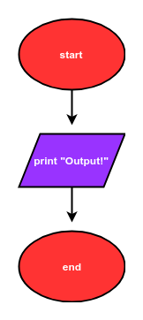
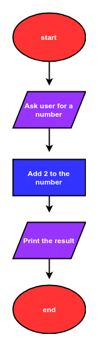
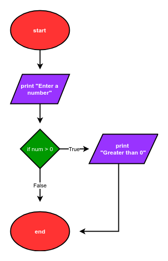

## Flowcharts
Flowcharts graphically represent the flow of a program. There are four basic shapes used in a flow chart. Each shape has a specific use:

 * oval: start / end
 * parallelogram: input / output
 * rectangle: calculations
 * diamond: selection structures
 

 
 Arrows connect the basic shapes in a flowchart. The shapes and arrows of a flowchart describe the flow of a program from start to end. Flowcharts typically flow from the top to the bottom or flow from the left to the right.
Below is the description of a simple program:

 > The program starts. Then the program prints out "Output!". Finally, the program ends.

A flowchart that describes this simple program is below:



The Python code that corresponds to this flowchart is:

```python
# start
print("Output!")
# end
```
A description of a program that includes a calculation is below:

 > The program starts. Next, the program asks a user for a number. Two is added to the number. Next, the resulting sum is printed. Finally, the program ends.

A flowchart that describes this program is below:



The Python code that corresponds to this flow chart is:

```python
# start
num = input("Enter a number: ")
num = float(num)
num_plus_2 = num + 2
print(num_plus_2)
# end
```
The description of another program is below:

 > The program starts. Next the program asks a user for a number. If the number is greater than zero, the program prints "Greater than 0", then the program ends.

A flow chart that describes this program is below:



The Python code that corresponds to this flow chart is:

```python
# start
num = input("Enter a number: ")
num = float(num)
if num>0:
    print("Greater than 0")
# end
```
The description of a more complex program is below:

 > The program starts. Next, the program asks a user for a number. If the number is greater than zero, the program prints "Greater than 0". If the number is less than zero, the program prints "Less than 0". Then the program prints "Done" and the program ends.

A flowchart that describes this program is below:


The Python code that corresponds to this flow chart is:

```python
# start
num = input('Enter a number: ')
num = float(num)
if num>0:
    print('num greater than zero')
if num<0:
    print('num less than zero')
print('Done')
# end
```
 

