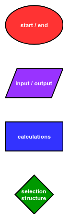
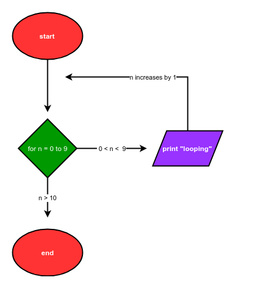
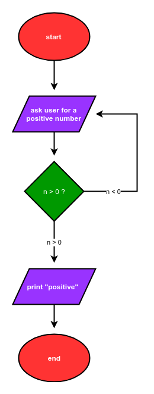

## Flowcharts Describing Loops
Flowcharts show the flow of a program graphically. Flow charts were introduced in the previous chapter to describe how a programs that include _if_ statements are illustrated graphically.

This chapter is about _loops_. Flowcharts can also be used to describe programs which contain _for loops_ and _while loops_.
### Basic Flow Chart Shapes
Let's review the four basic flowchart shapes. Each shape represents a different type of operation.

 * oval: start and end
 * parallelogram: input and output
 * rectangle: calculations
 * diamond: selection structures
 

 
The basic shapes in a flowchart are connected by arrows. The shapes and arrows in a flowchart represent the flow of a program from start to end.
### Flowchart of a program that contains a for loop
Below is the description of a program that can be coded with a for loop:

 > The program starts. The program prints the word "looping" 10 times. Finally, the program ends.

A flowchart that describes this program is below:



The Python code that corresponds to this flowchart is:

```python
# start
for i in range(10):
    print("looping")
# end
```
### Flowchart of a program that contains a while loop
Below is the description of a program which can be coded with a while loop:

 > The program starts. The program asks the user for a positive number. If the number the user enters is negative, the program asks the user for a positive number again. If the number the user enters is positive, the program prints "positive". Finally, the program ends.

A flowchart that describes this program is below:



The Python code that corresponds to this flow chart is:

```python
# start
num = -1
while num < 0:
    num = input("Enter a positive number: ")
    num = float(num)
print("positive")
# end
```
 

