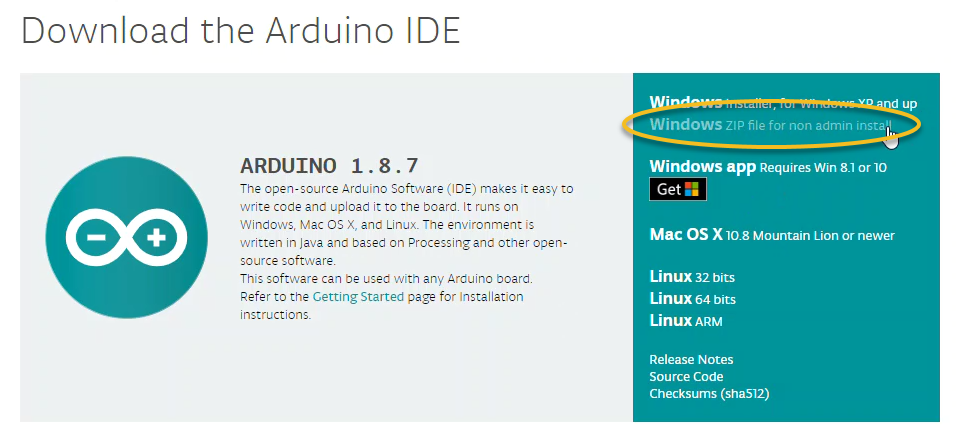
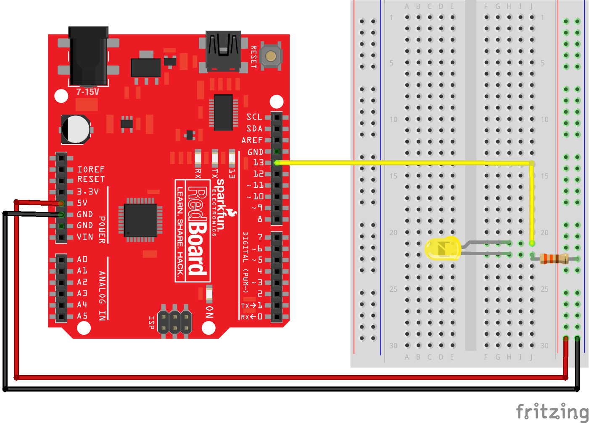
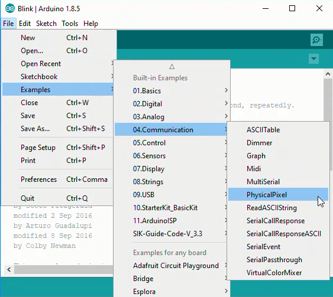
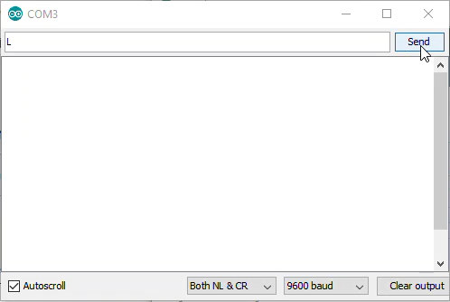

## Controlling an LED with Python
In this section, you will learn how to control an LED connected to an external piece of hardware (an Arduino) using Python. To accomplish this task, the following hardware is required:

 * A computer running Python
 * An Arduino
 * An LED
 * Wires, a resistor and a breadboard to connect the LED to the Arduino
 * A USB cable to connect the Arduino to the computer
You will also need to download the Arduino IDE (Integrated Development Environment). Download the Arduino IDE using the following link: 

 > [https://www.arduino.cc/en/Main/Software](https://www.arduino.cc/en/Main/Software)
 
If you are working on a computer that you don't have administrator privileges to install software on, be sure to select: [Windows ZIP for non-admin install].


### Wire the LED to the Arduino
Connect the LED to the Arduino using a resistor, wires and a breadboard. Note the short leg of the LED is connected to ground, and the long leg of the resistor is connected through a resistor to PIN 13. A resistor is needed to prevent too much current from flowing through the LED. This type of resistor is called a _pull up resistor_.

### Upload code to the Arduino
Upload the following code to the Arduino using the Arduino IDE. The code is same as in the example sketch called ```Physical Pixel```. The ```Physical Pixel``` sketch is found in the Arduino IDE under File --> Examples --> 04.Communication --> PhysicalPixel



The code for the Physical Pixel Sketch is shown below.
```text
// Arduino IDE: 
// File -> Examples -> 04.Communication -> PhysicalPixel

const int ledPin = 13; // pin the LED is attached to
int incomingByte;      // variable stores  serial data

void setup() {
  // initialize serial communication:
  Serial.begin(9600);
  // initialize the LED pin as an output:
  pinMode(ledPin, OUTPUT);
}

void loop() {
  // see if there's incoming serial data:
  if (Serial.available() > 0) {
    // read the oldest byte in the serial buffer:
    incomingByte = Serial.read();
    // if it's a capital H (ASCII 72), turn on the LED:
    if (incomingByte == 'H') {
      digitalWrite(ledPin, HIGH);
    }
    // if it's an L (ASCII 76) turn off the LED:
    if (incomingByte == 'L') {
      digitalWrite(ledPin, LOW);
    }
  }
}
```
### Connect the Arduino to the Computer
Connect the Arduino to the computer using a USB cable. Ensure two settings in the Arduino IDE are set correctly.

 * Make sure the ```Port``` is selected properly in the Arduino IDE under Tools --> Port. 
 * Make sure the ```Board``` is selected in the Arduino IDE under Tools --> Board --> Arduino/Genuino Uno

In the Arduino IDE, click the [checkmark] to verify and the [arrow] to upload. If the sketch does not upload, check which COM port is selected in Tools --> Port.


### Turn the LED on and off with the Arduino Serial Monitor
Open the Arduino Serial Monitor using Tools --> Serial Monitor. In the Serial Monitor type ```L``` or ```H``` and click [Send]. Observe the LED turn on and off. Send ```H``` to turn the LED on. Send ```L``` to turn the LED off.


### Use the Python REPL to turn the Arduino LED on and off
Next,  use the Python REPL to turn the Arduino on and off. (You can open the Python REPL by typing ``` > python``` at the **Anaconda Prompt**) At the Python REPL, type the following commands. If a REPL prompt ```>>>``` precedes the command, type the command into the REPL. If the line does not start with a REPL prompt, the line represents expected output. 

When you type the command: ```ser = serial.Serial('COM4', 9800, timeout=1)```, ensure the ```'COM#'``` corresponds to the port that worked with the Arduino IDE in Tools --> Port.

```python
>>> import serial
>>> import time

>>> ser = serial.Serial('COM4', 9600)  # open serial port
>>> time.sleep(2)                      # wait 2 seconds
>>> ser.name()
'COM4'

>>> ser.write(b'H')
# LED turns on

>>> ser.write(b'L')
# LED turns off

>>> ser.write(b'H')
# LED turns on

>>> ser.write(b'L')
# LED turns off

>>> ser.close()
>>> exit()
```

Ensure the command ```ser.close()``` is issued before exiting the Python REPL. 
### Write a Python Script to turn the LED on and off
After the LED turns on and off based on sending ```H``` and ```L``` with the Arduino Serial Monitor and you can turn the LED on and off with the Python REPL, it's time to write a Python script to turn the LED on and off. Again, the serial communication between the Python script and the Arduino is facilitated by the PySerial package. Ensure PySerial is installed before running the Python script. 

At the top of the Python script, import the PySerial package. Note that even though the package is called PySerial, the line ```import serial``` is used. Python's built-in ```time``` module is also imported as the ```time.sleep()``` function will be used in the script.
```python
# blink.py

import serial
import time
```
In the next part of the Python script, connect to the Arduino over the serial port. In the line ```ser = serial.Serial('COM4', 9800, timeout=1)```, ensure the ```'COM#'``` corresponds to the port that worked with the Arduino IDE. Then create a loop that blinks the Arduino LED on and off for about 5 seconds.  Notice the byte string ```b'H'``` is sent to the Arduino, not the Unicode string ```'H'```. The Unicode string ```'H'``` is prepended with the letter ```b``` in the line ```ser.writelines(b'H')```. This line of code turns the Unicode string into a byte string before it is sent to the Arduino.
```python
ser = serial.Serial('COM4', 9800, timeout=1)
time.sleep(2)

for i in range(10):
    ser.writelines(b'H')   # send a byte
    time.sleep(0.5)        # wait 0.5 seconds
    ser.writelines(b'L')   # send a byte
    time.sleep(0.5)

ser.close()
```     
Run the entire Python script and watch the Arduino LED blink ten times. A common problem is the serial port was not closed before the script starts. Make sure the Arduino Serial Monitor is closed and try running ```>>> ser.close()``` at the Python REPL.
### Write a Python script to allow a user to turn the LED on and off
Once the LED blinks on and off successfully using a for loop in a Python script, you can write a new Python script that allows a user to turn the LED on and off. At the top of the new Python script import the **PySerial** package and built-in ```time``` module.
```python
import serial
import time
```
Next, give the user instructions. If the user types ```H```, the LED turns on. If the user types ```L``` the LED turns off. If the user types ```q```, the program terminates.
```python
print('This is a program that allows a user to turn an LED on and off')
print('type H to turn the LED on')
print('type L to turn the LED off')
print('type q to quit')
```
Finally, the script needs a while loop to ask the user to enter the letter ```H```, ```L``` or ```q```. Once the user enters the letter, the letter is converted to a byte string. Next, the byte string is sent over the serial line to the Arduino. A delay is added so that the Arduino can process the command before reading with the next one.
```python
ser = serial.Serial('COM4', 9800, timeout=1)
time.sleep(2)

user_input = 'L'
while user_input != 'q':
    user_input = input('H = on, L = off, q = quit' : )
    byte_command = encode(user_input)
    ser.writelines(byte_command)   # send a byte
    time.sleep(0.5) # wait 0.5 seconds
        
print('q entered. Exiting the program')
ser.close()
```
Run the Python script. Type ```H``` and ```L``` and observe the LED turn on and off. Type ```q``` to end the program.
 

