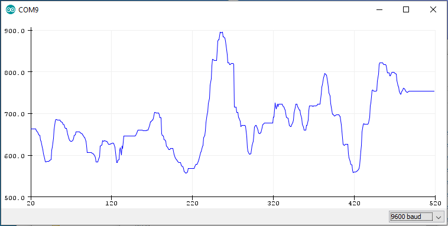
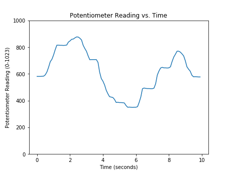

## Reading a Sensor with Python
In this section, you will learn how to read a sensor connected to an external piece of hardware (an Arduino) with Python. To accomplish this, the following hardware is required:

 * A computer running Python
 * An Arduino
 * A potentiometer (the sensor)
 * wires, a resistor, an LED, and a breadboard to connect the sensor to the Arduino
 * A USB cable to connect the Arduino to the computer

You will also need to download the Arduino IDE (the Arduino Integrated Development Environment) using the following link as shown in the previous section: 

 > https://www.arduino.cc/en/Main/Software

### Wire the sensor to the Arduino
Connect the potentiometer sensor to the Arduino using a resistor, wires and a breadboard. The middle pin of the potentiometer is connected to pin A0 on the Arduino (green wire). Connect the LED to the Arduino. Note the long lead of the LED is connected to PIN13 on the Arduino (yellow wire) and the short lead of the LED is connected through a resistor to ground (black wire). If the LED is wired backward, the LED will not turn on.

In the hardware schematic, the blue square with an arrow on it is a potentiometer. , and the user knows when the sensor signal changes because the user has turned the potentiometer dial.

The hardware schematic describes how to the Arduino, LED, resistor, and potentiometer are connected with jumper wires and a breadboard.

### Upload code to the Arduino
Once the LED and potentiometer are hooked up the Arduino, upload the following code to the Arduino using the Arduino IDE. Note that Arduinos don't use the Python programming language. The programming language used by Arduinos is a variant of the C programming language.

The Arduino sketch below (an Arduino program is called a sketch) accomplishes a couple things. First, the Arduino reads the potentiometer sensor value and stores the sensor value in the variable ```sensorValue```. Next, the Arduino sends the sensor value over the serial line (as a byte string). Finally, ```sensorValue``` is compared to ```500```. If ```sensorValue``` is less than ```500```, the LED stays off. If ```sensorValue``` is greater than ```500```, the LED turn on. The read-send-compare process repeats in a loop.
```text
// potentiometer_read.ino
// reads a potentiometer and sends value over serial
int sensorPin = A0;  // The potentiometer on pin 0                  
int ledPin = 13;     // The LED is connected on pin 13
int sensorValue;     // variable to stores data

void setup() // runs once when the sketch starts
{
  // make the LED pin (pin 13) an output pin
  pinMode(ledPin, OUTPUT);

  // initialize serial communication
  Serial.begin(9600);
}

void loop() // runs repeatedly after setup() finishes
{
  sensorValue = analogRead(sensorPin);  // read pin A0   
  Serial.println(sensorValue);         // send data to serial
  
  if (sensorValue < 500) {            // less than 500?
    digitalWrite(ledPin, LOW); }     // Turn the LED off
  
  else {                               // if sensor reading is greater than 500
    digitalWrite(ledPin, HIGH); }     // Keep the LED on
  
  delay(100);             // Pause 100 milliseconds before next sensor reading
}
```
### Connect the Arduino to the computer and Upload the Sketch
Connect the Arduino to the computer with a USB cable. In the Arduino IDE select Tools --> Board --> Arduino/Genuino Uno. Upload the sketch to the Arduino. In the Arduino IDE, click the [check mark] to verify and the [arrow] to upload. If the sketch does not upload, check which ```COM port``` is selected in the Arduino IDE under Tools --> Ports.  


### Check the Sensor Signal
To verify the Arduino sketch is working correctly, the sensor signal can be checked in three ways:

 * The LED turns on and off as the potentiometer dial is rotated
 * In the Arudino **Serial Monitor**, numbers change as the potentiometer dial is rotated
 * In the Arduino **Seral Plotter**, the line moves as the potentiometer dial is rotated
#### LED turns ON and OFF

The LED should turn on and off as the potentiometer is rotated. If the LED does not turn on and off when the potentiometer is rotated, make sure the potentiometer is turned back and forth through it's full range of rotation. Also, ensure the USB cable is plugged into both the Arduino and the computer.
#### Arudino Serial Monitor

Access the Arduino **Serial Monitor** using Tools --> Serial Monitor. 


If the Arduino sketch is working correctly, a running list of numbers is shown in the Arduino **Serial Monitor**. When the potentiometer is dialed back and forth, the numbers streaming down the **Serial Monitor** should change. The output in the Serial Monitor should be a running list of numbers between ```0``` and ```1024```.

If a running list of numbers can't be seen in the Arduino **Serial Monitor**, ensure [Auto Scroll], [Both NL & CR] and [9600 baud] are selected. Also, make sure the ```Port``` is set correctly in the Arduino IDE under Tools --> Port. 


#### Arduino Serial Plotter

To access the Arduino Serial Plotter, select Tools --> Serial Monitor in the Arduino IDE. Note the Arduino Serial Monitor needs to be closed before the Arduino Serial Plotter can be opened. If the sketch is working correctly, potentiometer rotation produces a moving line on the Arduino Serial Plotter. 


The output of the Arduino Serial Plotter should be a running line graph. The height of the line on the graph should change as the potentiometer is dialed back and forth. If the Arduino Serial Plotter is blank, make sure [9600 baud] is selected in the lower right corner of the Serial Plotter. Also, make sure the ```Port``` has been set correctly in the Arduino IDE in Tools --> Port.


### Use the Python REPL to read the potentiometer data

At the Python REPL, type the following commands. If the REPL prompt ```>>>``` precedes the command, type the command into the REPL. If the line does not start with a REPL prompt, this line represents expected output.

```python
# serial read using the Python REPL

Type "help", "copyright", "credits" or "license" for more information.
>>> import serial
>>> import time
>>> ser = serial.Serial('COM4',9600)
>>> time.sleep(2)
>>> b = ser.readline()
>>> b
b'409\r\n'
>>> type(b)
<class 'bytes'>
>>> str_rn = b.decode()
>>> str_rn
'409\r\n'
>>> str = str_rn.rstrip()
>>> str
'409'
>>> type(str)
<class 'str'>
>>> f = float(str)
>>> f
409.0
>>> type(f)
<class 'float'>
>>> ser.close()
>>> exit()

```
### Write a Python script to read the sensor
After the hardware is connected and the Arduino sketch is working correctly, you can construct a Python script to read the sensor value.

Communication between the Python script and the Arduino is accomplished using the PySerial package. Make sure PySerial is installed before the script is run.  See a previous section in this chapter on how to install the PySerial package.

At the top of the Python script, import the PySerial module. Note that although the package is called PySerial, use the line ```import serial``` to import the package.
```python
import serial
import time
```
Next, set up the serial communication line with the Arduino. Ensure the port specified in the command ```ser = serial.Serial('COM4', 9600)``` is the same ```COM#``` that was used in the Arduino IDE.
```python
# set up the serial line
ser = serial.Serial('COM4', 9600)
time.sleep(2)
```
Next, code a loop runs for about 5 seconds while data is collected from the sensor. If it seems like the loop is stuck, press [Ctrl] + [c].
```python
# Read and record the data
data =[]                       # empty list to store the data
for i in range(50):
	b = ser.readline()         # read a byte string
        string_n = b.decode()  # decode byte string into Unicode  
	string = string_n.rstrip() # remove \n and \r
	flt = float(string)        # convert string to float
	print(flt)
	data.append(flt)           # add to the end of data list
	time.sleep(0.1)            # wait (sleep) 0.1 seconds

ser.close()
```
After the data is collected, the data can be displayed with the Python's ```print()``` function and a ```for``` loop. The output looks like the numbers in the Arduino **Serial Monitor**.
```python
# show the data

for line in data:
    print(line)
```
The data can also be plotted with Matplotlib. The resulting plot looks like the line plot in the Arduino **Serial Plotter**.
```python
import matplotlib.pyplot as plt
# if using a Jupyter notebook include
%matplotlib inline

plt.plot(data)
plt.xlabel('Time (seconds)')
plt.ylabel('Potentiometer Reading')
plt.title('Potentiometer Reading vs. Time')
plt.show()
```
Run the entire script and twist the potentiometer. You should see the potentiometer values running by in the Python REPL command window.

After all the data is collected, you will see a plot like the one below.


 

