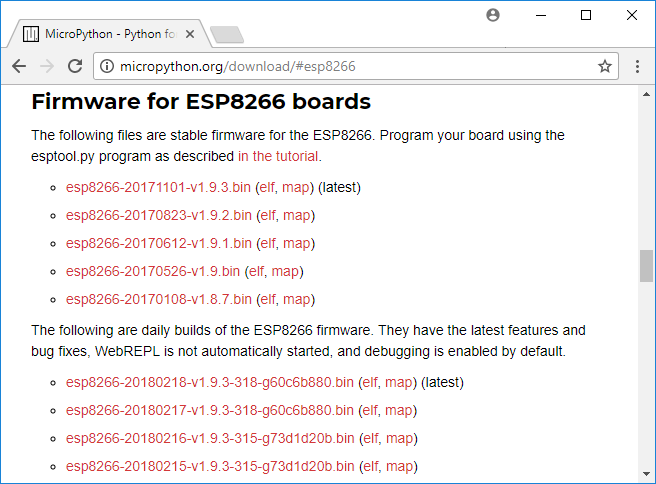
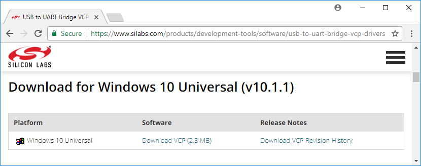
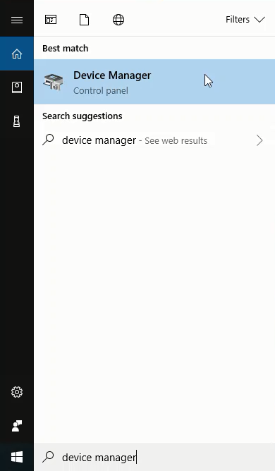
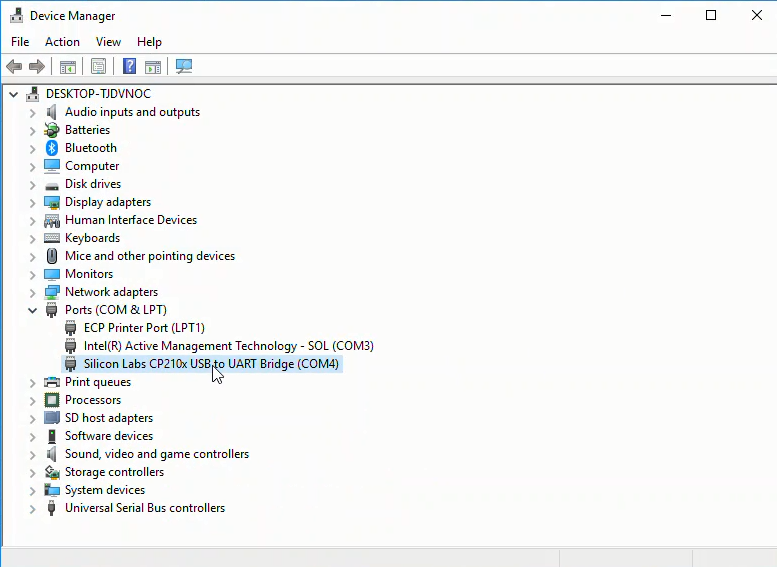
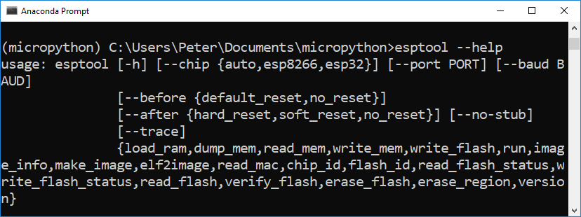
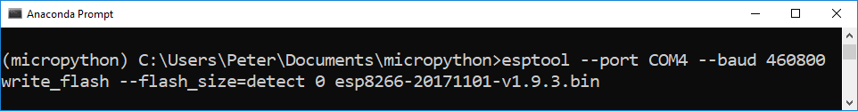
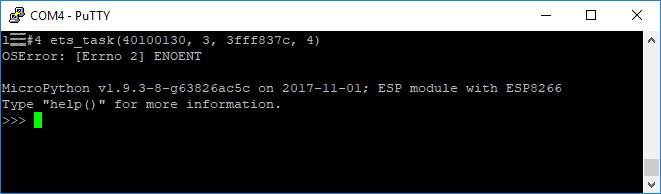

## Installing MicroPython
MicroPython is a port of the Python programming language that runs on small, inexpensive microcontrollers. In this section, you will learn how to install MicroPython on an ESP8266-based microcontroller such as the Adafruit Feather Huzzah ESP8266 and the ESP8266 NodeMCU using Python and a package called **esptool**. In subsequent sections, you will learn how to control an LED and read a sensor using MicroPython.
The following hardware is needed to install MicroPython on an ESP8266-based microcontroller:

| Hardware | Purpose |
| --- | --- |
| A laptop or desktop computer | install MicroPython on the microcontroller |
| Adafruit Feather Huzzah ESP8266 | microcontroller running MicroPython |
| micro USB cable | connect the microcontroller to computer |

The following software is used to install MicroPython on an ESP8266-based microcontroller:

| Software | Purpose |
| --- | --- |
| Anaconda distribution of Python | run **esptool** that installs MicroPython |
| Anaconda Prompt | Install **esptool** package with **pip** |
| **esptool** | A **pip** installable package used to install MicroPython |
| firmware **_.bin_** file | Version of MicroPython run on the microcontroller |
### Summary of Steps:
1. Install the [Anaconda distribution](https://www.anaconda.com/download/) of Python
2. Create a new conda environment and ```pip install esptool```
3. Download the [latest MicroPython .bin firmware file](http://micropython.org/download#esp8266)
4. Install the [SiLabs driver](https://www.silabs.com/products/development-tools/software/usb-to-uart-bridge-vcp-drivers) for the Adafruit Feather Huzzah ESP8266
5. Connect the ESP8266-based microcontroller board to the laptop using a micro USB cable
6. Determine which serial port the microcontroller is connected to
7. Run the **esptool** to upload the **_.bin_** firmware file to the microcontroller
8. Download and install [PuTTY](https://www.putty.org/), a serial monitor
9. Use PuTTY to connect to the microcontroller and run commands at the MicroPython REPL
### Install the Anaconda distribution of Python
If you don't have the Anaconda distribution of Python installed already, go to [Anaconda.com/download](https://www.anaconda.com/download/) to download and install the latest version.
### Create a new conda environment and install **esptool**
To install MicroPython on the ESP8266-based microcontroller, we will start by creating a _virtual environment_. A virtual environment is an isolated Python interpreter and a set of packages that are separate from the base version of Python running on your computer. We'll create a new virtual environment with the **Anaconda Prompt** and the conda command line tool.

Open the **Anaconda Prompt** and create a new virtual environment named ```micropython```. Activate the environment with the command ```conda activate```. After activating the virtual environment, you should see the virtual environment name ```(micropython)``` before the ``` > ``` Prompt.  Once inside the virtual environment, use ```pip``` to install ```esptool```. ```esptool``` will be used to upload the MicroPython **_.bin_** firmware file onto the ESP8266-based microcontroller. Confirm that ```esptool``` is installed in the ```(micropython)``` virtual environment by running the command ```conda list```. The list of commands below also creates a new directory in the ```Documents``` folder called ```micropython``` to store all the project files. 

```text
> conda create -n micropython python=3.6
> conda activate micropython
(micropython) > pip install esptool
(micropython) > conda list
(micropython) > cd Documents
(micropython) > mkdir micropthon
(micropython) > cd micropython
```
### Download the latest MicroPython firmware .bin file
Go to GitHub.com and download the latest **_.bin_** firmware file at [micropython.org/download#esp8266](https://micropython.org/download#esp8266). Move the **_.bin_** firmware file to a new ```micropython``` directory. The **_.bin_** firmware file is the version of MicroPython that runs on the ESP8266 microcontroller. Straight from the manufacturer, the ESP8266 microcontroller probably does not have MicroPyton installed, so we need to install MicroPython ourselves. After installing the Micropython **_.bin_** firmware file onto the board, we will be able to bring up the MicroPython REPL prompt, type commands into the Micropython REPL and run Micropython **_.py_** scripts on the board.


### Install the SiLabs driver for the ESP8266-based microcontroller
Before we connect the ESP8266-based microcontroller such as an Adafruit Feather Huzzah ESP8266 or ESP8266 NodeMCU to the computer, a specific driver needs to be installed. For Windows 10 laptop to see the board, the [CP210x USB to UART Bridge VCP driver](https://www.silabs.com/products/development-tools/software/usb-to-uart-bridge-vcp-drivers) needs to be downloaded from SiLabs and installed. The driver download and installation is quick and easy but does require administrator privileges.


### Connect the ESP8266-based microcontroller to the computer
Use a microUSB cable (the same kind of cable that charges many mobile phones) to connect the ESP8266-based microcontroller to the computer. Make sure the microUSB cable is a full **USB data cable** and not just a power only cable. If you have trouble getting the microcontroller to work, one reason might be the micoUSB cable you are using is only a charging cable and can not transfer data.
### Determine which serial port the ESP8266-based microcontroller is connected to
Use the Windows Device Manager to determine which serial port the ESP8266-based microcontroller is connected to is connected to. The serial port is one of the parameters which needs to be defined when the **_.bin_** firmware file is upload on the board.

Look for something like **Silicon Labs CP210x USB to UART Bridge (COM4)** in the **Ports (COM & LPT)** menu of the Windows Device Manager. TCP210x USB to UART Bridge refers to the chip that handles serial communication on the board, not the ESP8266 chip itself. Make a note of the number after **(COM )**. The serial port number often comes up as **(COM4)** but it may be different on your computer. 




### Run esptool to upload the .bin file to the ESP8266-based microcontroller
Open the Anaconda Prompt with the Windows Start Menu and ```cd```(change directory) into the ```micropython``` directory which contains the **_.bin_** file. Use the ```dir``` command to see the ```micropython``` directory contents. Make sure the **_.bin_** firmware file is in the directory. The **_.bin_** firmware file is named something like ```esp8266-20171101-v1.9.3.bin```. Activate the micropython virtual environment with the command ```conda activate micropython```. Run ```esptool --help``` to ensure **esptool** is installed properly. Note there is no **.py** extension after ```esptool```. On Windows , the command ```esptool``` works, but the command ```esptool.py``` may not. (Note this behavior is different than the commands shown on the [MicroPython docs](https://docs.micropython.org/en/latest/esp8266/esp8266/tutorial/intro.html#deploying-the-firmware)). If you try to run ```esptool``` and you are not in the ```(micropython)``` virtual environment, an error is returned. 

```text
> cd Documents
> cd micropython
> pwd
Documents/micropython
> dir
> conda activate micropython
(micropython) > esptool --help
```



Before uploading the **_.bin_** firmware file to the ESP8266-based microcontoller, it is best practice to first erase the flash memory on the board using the command ```esptool erase_flash```. Make sure to specify the ```--port```. The argument after ```--port``` is the ```COM``` port assigned to the ESP8266 board shown in the Windows Device Manager.  This port often comes up as ```COM4```.

```text
(micropython) > esptool --port COM4 erase_flash
```


Now you can finally write the **_.bin_** firmware file to the flash memory on the microcontroller using the ```esptool write_flash``` command. Make sure to use the exact firmware file name you see sitting in the ```micropython``` directory. The port needs to be set corresponding to the port you found in the Windows Device Manager. ```---baud``` is the baud rate or upload speed. I found that ```--baud 460800``` worked, but you could also specify ```--baud 115200``` which is slower. The upload time was a matter of seconds with either baud rate. The ```0``` after ```--flash_size=dectect``` means the firmware is written at the start of the flash memory (the 0th position) on the board. Again, make sure the **_.bin_** firmware file name is correct. The long file name is easy to mistype.

```text
(micropython) > esptool --port COM4 --baud 115200 write_flash \
--flash_size=detect 0 esp8266-20171101-v1.9.3.bin
```


### Download and install PuTTY, a serial monitor
Now that MicroPython is installed on the ESP8266-based microcontroller, we can communicate with our board over a serial connection. However, Windows doesn't have a built-in serial monitor (like **screen** on MacOS and Linux). Therefore, if you are using the Windows operating system, you need to download and install a serial communication tool like **PuTTY**.

PuTTY is a lightweight serial and SSH client for Windows. PuTTY provides an interface to communicate with the ESP8266-based microcontroller. [PuTTY can be downloaded here](https://www.putty.org/). PuTTY is pretty small, and the download and installation are quick.


### Connect to the ESP8266-based Microcontroller with PuTTY
Ensure the ESP8266-based microcontroller is connected to the computer with a USB cable and ensure the board is visible in the Windows Device Manager. Then use PuTTY to connect to the board over serial.  Make sure to specify the correct serial port in the **Serial line** box and set **115200** baud in the Speed box. **Micropython is set to run at 115200 baud**, other baud rates will lead to junk characters in the serial monitor. Make sure to select the **Serial** radio button below the header **Connection type:** near the top of the PuTTY window. Overlooking this detail is easy. 


If you see ```>>>``` the MicroPython REPL (the MicroPython prompt), MicroPython is successfully installed on your ESP8266-based microcontroller.

Sometimes, you may need to type [Enter] or Ctrl-D to bring up the ```>>>``` REPL prompt. If the ```>>>``` REPL prompt is not displayed in your PuTTY window, try to close PuTTY, unplug then replug the board and open PuTTY again. Most ESP8266-based microcontrollers also have a tiny little black RESET button that can be pressed to restart the board.  



At the ```>>>``` MicroPython REPL prompt try the following commands:

```text
>>> print('Problem Solving with MicroPython!')
Problem Solving with MicroPython!

>>> import sys
>>> sys.platform
'esp8266'
```


 

